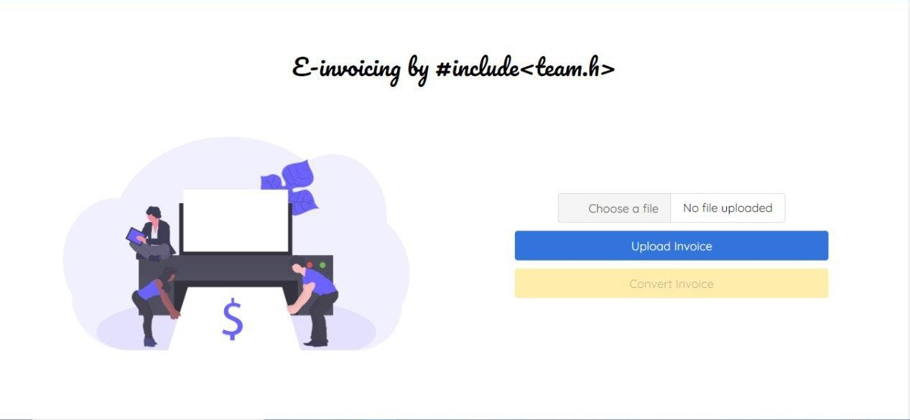

# Electronic-Invoicing 
Scanned invoices are extracted using image processing to reduce the non-reliability and man-power in calculating payments and invoice bills. Additionally, the whole payment process is automated with less turn around time and more flexibility in the invoice templates.

## Snippets

## Deliverables

## Instructions 
As the video was large, we uploaded it in Youtube.
Please refer to video here - 

Instructions:
1) Install all the dependencies mentioned in the requirements.txt if you are running in localhost. 
2) The output directory is given as output/dataset1/. So to run the program, create that path from your current directory either in the local machine or in the GDrive to which colab is attached to.
	Note: Running in colab is recommended to get better performance.
4) Move all the five 5 ipynb modules and 2 folders (static, templates) to your current directory in local machine or in colab.
5) If you are running in Colab, connect to the runtime environment and mount the GDrive.
6) Now, after installing the dependencies in local machine, run the flask.py file. Otherwise, give RUN ALL in flask.ipynb file in Colab. It will automatically install all the dependencies.
7) After uploading the invoice pdf file, give "upload".
8) The "convert" button will later be enabled. Click the convert button.
9) Now a "download" button will appear. Also a .zip file created with all the assets in the "output" folder called dt1.zip
	Note: The "download" button will work only in colab, only when the url for the zip is given. But the zip will be created already both in the localhost and GDrive.
10) If there are any issues, I request you to mailto sathiyajith19@gmail.com
